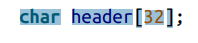
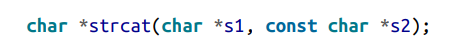

# Summary to Understanding and Using C Pointers
 
 

 **CH 1 Introduction**

**Support for dynamic memory**

**variables that store address for memory location pointers and memory static and global** :  located in the start and remain until program terminates all have access to global

**Automatic**: created when function is called 

**Dynamic**: allocated from heap is the scope is limited to pointer 

- pointer only contain addresses

**why should become proficient with pointers:** 

• Creating fast and efficient code

• Providing a convenient means for addressing many types of problems

• Supporting dynamic memory allocation

• Making expressions compact and succinct

• Providing the ability to pass data structures by pointer without incurring a large

overhead

• Protecting data passed as a parameter to a function

` `**Pointer Declaring** :

data type \* ptr

**how to read declaration backward**:

`		`const int pci\* à pci is a pointer to  a constant integer

`		`int \*num;  

`		`num=0;

`		`int \*pi; 

`		`pi =num à invalid conversion

`		`pi=(int\*) num;   à valid conversion 

\*%p print the address in upper case\*

**Virtual memory and pointer:**

**Virtual operating system (VOS)** :allows a program to split across the machines physical address space

**APP split into pages /frames** à represented in area of main memory

Pages of apps allocated in different , non contiguous areas

- If OS need memory held by page memory may swapped out to secondary storge
- Address used by program is virtual 
- OS maps virtual to physical

**Dereferencing a pointer using in direction**

Int  num=5 ; int \*pi=&num à put the value in address of num in \*pi

**Pointer to function**:

`		`Void (\*foo)();

**The Concept of Null:**

- The concept of null is interesting and sometimes misunderstood. 
- Confusion can occur because we often deal with several similar, yet distinct concepts, including:

• The null concept

• The null pointer constant

• The NULL macro

• The ASCII NUL

• A null string

• The null statement àNull means pointer doesn’t point to anything

\*Pointer can hold a special value that not equal to each other\*

\* Null concept is an abstraction supported by null pointer (may be 0 or Null)\*

\* Null micro is constant int 0 cast to void\*

`       `**\***ASCII NULL defined byte containing all zeros (not pointer null)\*

**String** à sequence of char terminates by zero Value, Null string is an empty string doesn’t contain any characters

\*Null used to end the linked list\*

**Unintialized pointer**  à can contain any value

**Null pointer** à pointer containing null doesn’t reference to anuy location in memory

**When execute null pointer it cause program termintating** 

- Use null or 0: some developers use null to reminder that working with pointers other wise use 0 be simply hidden
- Int num int \*pi=0 àzero null pointer 
- Pi=&num \*pi=0 à zero I value

**Pointer to void** 

Void \*pi;

- Have the same as char
- Will never be equal to another 
- Two void pointer with null will be equal

Size\_t =sizeof(void\*) à legal

Size\_t =sizeof(void) à illegal 

- Global or statice pointers saved as null in the memory
- Size\_t : maximum size of any object can be in c(unsigned integer 
- Used as return type for size\_of
- As argument to may function (malloc ,strlen)

**Uses**: 

- Declaring variables 
- Loop counter 
- Indexing into array 

\*The max possible value is SIZE\_MAX\*

\*Not good odea to assume size\_t the same size as a pointer\*

\*When print size\_t use (%zu,%V,%LV)\*

**Using int ptr\_t and uintptr\_t** :

- Used for sorting pointer addresses 
- Portable and state way of declaring pointer 
- Useful for converting pointers to their integer representation
- If we try to assign the addresses of an intger to apointer of type uintptr\_t 

**Uintptr\_t \*pv=&num**

**Invalid conversion**

**Uintptr\_t  \*pv =(uintptr\_t\* )&num**

**Uintptr we have to use casting**

**1- adding: the amount is the product of the integer times the number of bytes**

**Pointer to void:**

Int num=5

Void \*pi=&num;

Pv à address                               pv=pv+1 à warning

**Subtracting two pointers :**

When two pointers is subtractes from another  we get the difference is not normally useful except using in order array elements

**Common uses of pointers :**

àmultiple levels of indirection

**Constants to pointer:**

Using constant keyword à protections

**Pointers to constant:** 

- Pointer can not be used to modify the value it is referencing 

 à legal

 à illegal because pci canot be dereferenced to chage what it points to

**Const int \*pci = int const \*pci;**

- Constant pointer to non constant : it means that while pointer cannot be changed the data pointed can be modified
- Int num;
- Int \* const cpi=&num
- Cpi cant be modified the data can be modified 

**Constant pointer to constants**

Const int \*const cpi=&limit  cant modify data or pointer 

Pointer to constant pointer to constant

**Conclusion :**

**CH2** Dynamic Memory Management in C

C99 created variable length array (VLA) definded at run time

**Basic steps used fo dynamic memory allocation:**

- Use malloc to allocate
- Use this memory to support application
- Deallocate the memory using free

Malloc return a pointer to memory allocater from the heap

Int \*pi;

\*pi =(int\*) malloc(sizeof(int)) à it will assign the address returned by malloc to the address store in pi

Pi=(int\*) malloc(sizeof(int)) à it will assign the address returned by malloc to pi

**Memory leaks :**

**Occurs when allocated memory is never used again and not freed**:
**because** 

- **Address lost**

- **Hidden leaks (free function never called)**
- Memory leaks can also occur when the program should release memory but does not.
- When object is kept in heap even this object is no longer needed
- When freeing structures created using struct if the structure contains pointer to dynamic memory

**Malloc return type:**

- If memory not available à null
- Void \* malloc (size\_t)
- Null value returned if give negative number
- When malloc is usef with argument of zeros it may return a pointer to null or a pointer with region with zero byte

\*Good practice to check null pointer before use\* 

**“lazy initialization” where it does not actually allocate the memory until it is ac‐**

**cessed?** 

- A problem can arise at this point if there is not enough memory available to

allocate.

**Calloc (clear and allocate area)**

- If number of size is 0 à errno, is set to ENOMEM 

**Realloc function return:**

If we dereferenced of freed pointer the behavior is undefined

Freeing Memory upon Program Termination:

**Dangling pointers:**

If pointer still references the original memory after it has been freed it called dangling

**Example :**

The variable pi will still hold the integer’s address. However, this memory may be reused

by the heap manager and may hold data other than an integer.

**Garbage Collection in C**

**Resource Acquisition Is Initialization:**

- Resource Acquisition Is Initialization (RAII) is a technique invented by Bjarne

Stroustrup.

- ` `It addresses the allocation and deallocation of resources in C++. 
- The tech‐nique is useful for guaranteeing the allocation and subsequent deallocation of a resource

in the presence of exceptions.

**Using Exception Handlers:**

exception handling is not a standard part of C

**Ch3 Stack frame**

**Passing pointer** 

- Passing pointers allows the reference object to be accessible in multiple function without making the object global
- If data need to be modified in function it need to be passed by pointers 
- Parameters including pointers are passed by value
- Passing by pointer to the object means the object doesn’t have to be copied 

**Passing Data Using a Pointer:**

**Passing Data by Value**:

**Passing a Pointer to a Constant:**

we are only passing the address of the data and can avoid copying large amounts of memory

**Returning a Pointer:**

à Allocate memory within the function using malloc and return its address.

` `à The caller is responsible for deallocating the memory returned.

àPass an object to the function where it is modified. 

àThis makes the allocation and deallocation of the object’s memory the caller’s responsibility.

**Pointers to Local Data:**

Returning a pointer to local data is an easy mistake to make if you don’t understand

how the program stack works.

**Passing a Pointer to a Pointer**:
when pointer passed to function it is by value 

If u need to modify the original not the copy we need to pass as a pointer to pointer

**Function Pointers:** 

- ` `pointer that hold address of function
- Executing function in order that may be not known at compile time
- Branch prediction is tech when the proscessor will guess the sequence of execution
- Pipelining performance using over lapping instruction exection

**Declaring function pointers** : must be carful to ensure it is used because doesnot check if correct parameter is passed or not

      

**Returning function pointer:** Returning a function pointer requires declaring the function’s return type as a function pointer.

**Comparing Function Pointers :** Function pointers can be compared to one another using the equality and inequality operators

Casting Function Pointers A pointer to one function can be cast to another type. This should be done with care since the runtime system does not verify that parameters used by a function pointer are correct.

**CH 4 pointers and arrays**

Jagged array is two dimensional array when each row may have different number of columns 

\*To determine number of elements in the array  size = sizeof(array) / sizeof(int)\*

**Array notation :**

` `

**Difference  between array and pointers**

Vector[i]				                          vector+i

Start with location I moves I positions from this location                          start with address vector add I to the address 

**Passing a One-Dimensional Array:**

The array address passed by value 

àA common mistake to use sizeof operation to determine number of elements  

**Pointers and Multidimensional Arrays**

**Declaration :**

**Passing a Multidimensional Array :**

The following declaration will not work correctly: 

void display2DArray(int \*arr[5], int rows) {

While it will not generate a syntax error, the array passed is assumed to be a five-element array of pointers to integers.

When passing array with more than one dimension always but the size of the first dimension need to be specified 

**Allocating Potentially Noncontiguous Memory**

**Allocating Contiguous Memory**

**CHAPTER 5 Pointers and Strings**

A string is a sequence of characters terminated with the ASCII NUL character. 

àThe ASCII character NUL is represented as \0. 

àStrings are commonly stored in arrays or in memory allocated from the heap.

à not all arrays of characters are strings. 

àAn array of  char may not contain the NUL character. 

è Arrays of char have been used to represent smaller integer units, such as boolean, to conserve memory space in an application.

**There are two types of strings in C:** 

**Byte string** : Consists of a sequence of char data type 

**Wide string**:  Consists of a sequence of wchar\_t data type The wchar\_t data type is used for wide characters and may be either 16 or 32 bits in width.

**String Declaration** 

**The String Literal Pool** :

This area of memory holds the character sequences making up a string. When a literal is used more than once, there is normally only a single copy of the string in the string literal pool.

**Initializing an array of char** 

**Initializing a pointer to a char**

The following assignment is invalid. We cannot assign the address of a string literal to an array name. char header2[]; header2 = "Media Player";

When determining the length of a string to be used with the malloc function: 

• Always remember to add one for the NUL terminator. 

• Don’t use sizeof operator. Instead, use the strlen function to de‐ termine the length of an existing string. 

- The sizeof operator will return the size of an array or pointer, not the length of the string.

**Initializing a string from standard input**

**Standard String Operations**

**Comparing Strings**

- Negative If s1 precedes s2 lexicographically (alphabetically) 
- Zero If the two strings are equal 
- Positive If s1 follows s2 lexicographically

**Copying Strings**

Two pointers can reference the same string. When two pointers reference the same location, this is called aliasing.

The basic approach is to:

1\. Read in the string using a large array of char 

2\. Use malloc to allocate just the right amount of memory

3\. Use strcpy to copy the string into the dynamically allocated memory

Concatenating Strings :

**Example:** 

**Passing a Simple String**

Passing a Pointer to a Constant char Passing a pointer to a string as a constant char is a very common and useful technique. 

It passes the string using a pointer, and at the same time prevents the string being passed from being modified.

Passing a String to Be Initialized There are situations where we want a function to return a string initialized by the func tion.

• The buffer’s address and its size must be passed

` `• The caller is responsible for deallocating the buffer 

• The function normally returns a pointer to this buffer

Returning Strings When a function returns a string, it returns the address of the string.

Returning the Address of Dynamically Allocated Memory

C supports command line arguments using the traditionally named argc and argv parameters. The first parameter, argc, is an integer that indicates how many parameters are passed. At least one parameter is always passed.

The second parameter, argv, is normally viewed as a one-dimensional array of string pointers.

**Pointers and Structures :**

**Declaration :**

Use (->)  to access the first declaration 

Use (.) to access the second declaration 

**How Memory Is Allocated for a Structure:**

àthe amount allocated to the structure is at min‐ imum the sum of the size of its individual fields.

àthe size is often larger than this sum because padding can occur between fields of a structure.

` `àThis padding can result from the need to align certain data types on specific boundaries. 

**Example :**

**Avoiding malloc/free Overhead :**

When user no longer needs an instance it is returned to the pool 

**Ch 7 Security Issues and the Improper Use of Pointers**

- ` `Writing secure apps in C can be difficult 
- C doesn’t prevent the programmer from writing out side the array

The Address Space Layout Randomization (ASLR) process arranges an application’s data region randomly in memory.

The Data Execution Prevention (DEP) technique prevents the execution of code if it is in a nonexecutable region of memory.

**we will examine security issues from several perspectives:**

` `• Declaration and initialization of pointers 

• Improper pointer usage 

• Deallocation problems

**Improper Pointer Declaration :**

This declaration declared ptr1 as a pointer to an integer and ptr2 as an integer.

The same problem there 

**Failure to Initialize a Pointer Before It Is Used** 

- Using a pointer before it is initialized can result in a run-time error. This is sometimes referred to as a wild pointer.

**Dealing with Uninitialized Pointers:**

• Always initialize a pointer with NULL

` `• Use the assert function

` `• Use third-party tools

**The assert function can also be used to test for null pointer values**
 
- If the expression is true, then nothing happens.
- ` `If the expression is false, then the program terminates.

**Pointer Usage Issues**

àBuffer overflow occurs when memory outside the object’s bounds is overwritten.

àIf the buffer overflow occurs within the application’s address space, then it can result in unauthorized access to data and/or the transfer of control to another segment of code

**Buffer overflow can happen by:** 

• Not checking the index values used when accessing an array’s elements 

• Not being careful when performing pointer arithmetic with array pointers 

• Using functions such as gets to read in a string from standard input 

• Using functions such as strcpy and strcat improperly

Test for NULL:

**Dangling Pointers:**

A dangling pointer occurs when a pointer is freed but still references that memory

Accessing Memory Outside the Bounds of an Array:

Nothing can prevent a program from accessing memory outside of the space allocated for an array.

Calculating the Array Size Incorrectly :

When passing an array to a function, always pass the size of the array at the same time

Misusing the sizeof Operator:

An example of misusing the sizeof operator occurs when we attempt to check our pointer bounds but do it incorrectly.

**Bounded Pointers:**

The term bounded pointers describes pointers whose use is restricted to only valid regions

Double Free Freeing a block of memory twice is referred to as double free

Clearing Sensitive Data:

It is a good idea to overwrite sensitive data in memory once it is no longe
