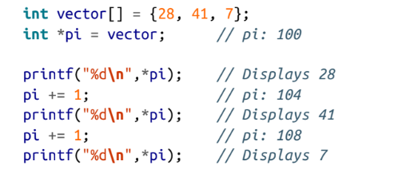

Support for dynamic memory

variables that store address for memory location pointers and memory static and global : located in the start and remain until program terminates all have access to global

automatic: created when function is called 

dynamic: allocated from heap is the scope is limited to pointer 

pointer only contain addresses

why should become proficient with pointers 

• Creating fast and efficient code

• Providing a convenient means for addressing many types of problems

• Supporting dynamic memory allocation

• Making expressions compact and succinct

• Providing the ability to pass data structures by pointer without incurring a large

overhead

• Protecting data passed as a parameter to a function

Declaring : data type \* ptr

how to read declaration backward:

const int pci\* à pci is a pointer to  a constant integer

int \*num;  

num=0;

int \*pi; 

pi =num à invalid conversion

pi=(int\*) num;   à valid conversion 

%p print the address in upper case

Virtual memory and pointer:

Virtual operating system (VOS) :allows a program to split across the machines physical address space

APP split into pages /frames à represented in area of main memory

Pages of apps allocated in different , non contiguous areas

- If OS need memory held by page memory may swapped out to secondary storge
- Address used by program is virtual 
- OS maps virtual to physical

Dereferencing a pointer using in direction

Int  num=5 ; int \*pi=&num à put the value in address of num in \*pi

Pointer to function:

Void (\*foo)();

The Concept of Null

The concept of null is interesting and sometimes misunderstood. Confusion can occur

because we often deal with several similar, yet distinct concepts, including:

• The null concept

• The null pointer constant

• The NULL macro

• The ASCII NUL

• A null string

• The null statement

Null means pointer doesn’t point to anything

àPointer can hold a special value that not equal to each other

` `à Null concept is an abstraction supported by null pointer (may be 0 or Null)

`        `à Null micro is constant int 0 cast to void

Non zero bit ????

ASCII NULL defined byte containing all zeros (not pointer null)

String à sequence of char terminates by zero Value, Null string is an empty string doesn’t contain any characters

Null used to end the linked list

Unintialized pointer  à can contain any value

Null pointer à pointer containing null doesn’t reference to anuy location in memory

When execute null pointer it cause program termintating 

- Use null or 0: some developers use null to reminder that working with pointers other wise use 0 be simply hidden
- Int num int \*pi=0 àzero null pointer 
- Pi=&num \*pi=0 à zero I value

Pointer to void 

Void \*pi;

- Have the same as char
- Will never be equal to another 
- Two void pointer with null will be equal

Size\_t =sizeof(void\*) 

Size\_t =sizeof(void) x 

- Global or statice pointers saved as null in the memory
- Size\_t :mcimum size of any object can be in c(unsigned integer 
- Used as return type for size\_of
- As argument to may function (malloc ,strlen)
- Uses: 
- Declaring variables 
- Loop counter 
- Indexing into array 

The max possible value is SIZE\_MAX

Not good odea to assume size\_t the same size as a pointer

When print size\_t use (%zu,%V,%LV)

Using int ptr\_t and uintptr\_t :

Used for sorting pointer addresses 

Portable and state way of declaring pointer 

Useful for converting pointers to their integer representation

If we try to assign the addresses of an intger to apointer of type uintptr\_t 

Uintptr\_t \*pv=&num

Invalid conversion 

Uintptr\_t  \*pv =(uintptr\_t\* )&num 

Uintptr we have to use casting 

1- adding: the amount is the product of the integer times the number of bytes

Pointer to void 

Int num=5

Void \*pi=&num;

Pv à address                               pv=pv+1 à warning

Subtracting two pointers :

When two pointers is subtractes from another  we get the difference is not normally useful except using in order array elements

Common uses of pointers :

àmultiple levels of indirection

Constants to pointer

Using constant keyword à protections

Pointers to constant 

- Pointer can not be used to modify the value it is referencing 

 à legal

 à illegal because pci canot be dereferenced to chage what it points to

Const int \*pci = int const \*pci;

- Constant pointer to non constant : it means that while pointer cannot be changed the data pointed can be modified
- Int num;
- Int \* const cpi=&num
- Cpi cant be modified the data can be modified 

Constant pointer to constants

Const int \*const cpi=&limit  cant modify data or pointer 

Pointer to constant pointer to constant

Conclusion :

Ch2

C99 created variable length array (VLA) definded at run time

Basic steps used fo dynamic memory allocation:

- Use malloc to allocate
- Use this memory to support application
- Deallocate the memory using free

Malloc return a pointer to memory allocater from the heap

Int \*pi;

\*pi =(int\*) malloc(sizeof(int)) à it will assign the address returned by malloc to the address store in pi 

Pi=(int\*) malloc(sizeof(int)) à it will assign the address returned by malloc to pi

Memory leaks :

Occurs when allocated memory is never used again and not freed:
because 

- Address lost

- Hidden leaks (free function never called)
- Memory leaks can also occur when the program should release memory but does not.
- When object is kept in heap even this object is no longer needed
- When freeing structures created using struct if the structure contains pointer to dynamic memory

Malloc return type:

- If memory not available à null
- Void \* malloc (size\_t)
- Null value returned if give negative number
- When malloc is usef with argument of zeros it may return a pointer to null or a pointer with region with zero byte

Good practice to check null pointer before use 

“lazy initialization” where it does not actually allocate the memory until it is ac‐

cessed? A problem can arise at this point if there is not enough memory available to

allocate.

Calloc (clear and allocate area)

- If number of size is 0 à errno, is set to ENOMEM 

Realloc function return:

If we dereferenced of freed pointer the behavior is un defined

Freeing Memory upon Program Termination

Dangling pointers

If pointer still references the original memory after it has been freed it called dangling

Exampke :

The variable pi will still hold the integer’s address. However, this memory may be reused

by the heap manager and may hold data other than an integer.

Garbage Collection in C

Resource Acquisition Is Initialization:

Resource Acquisition Is Initialization (RAII) is a technique invented by Bjarne

Stroustrup. It addresses the allocation and deallocation of resources in C++. The tech‐

nique is useful for guaranteeing the allocation and subsequent deallocation of a resource

in the presence of exceptions.

Using Exception Handlers:

exception handling is not a standard part of C

Stack frame

Ch3

Passing pointer 

- Passing pointers allows the reference object to be accessible in multiple function without making the object global
- If data need to be modified in function it need to be passed by pointers 
- Parameters including pointers are passed by value
- Passing by pointer to the object means the object doesn’t have to be copied 

Passing Data Using a Pointer

Passing Data by Value:

Passing a Pointer to a Constant

we are only passing the address of the data and can avoid copying large amounts of memory

Returning a Pointer

• Allocate memory within the function using malloc and return its address. The

caller is responsible for deallocating the memory returned.

Pass an object to the function where it is modified. This makes the allocation and

deallocation of the object’s memory the caller’s responsibility.

Pointers to Local Data

Returning a pointer to local data is an easy mistake to make if you don’t understand

how the program stack works.

Passing a Pointer to a Pointer:
when pointer passed to function it is by value 

If u need to modify the original not the copy we need to pass as a pointer to pointer>

Function Pointers

